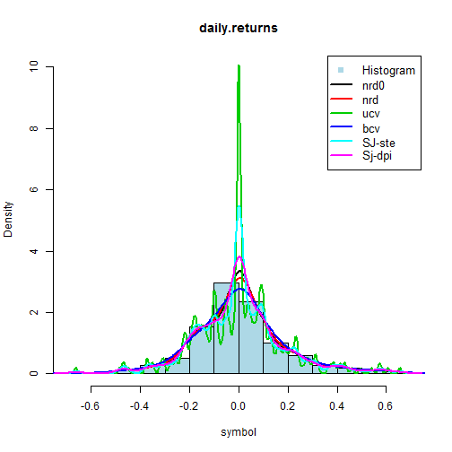
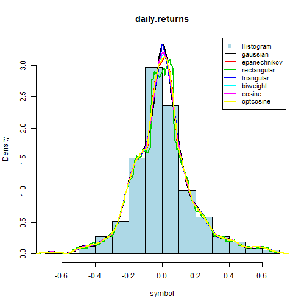
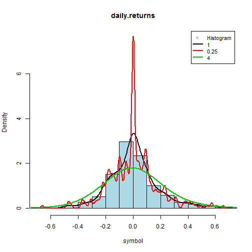

Kernel density estimation
========================================================
author: Pawel Borowiec
date: November 2014
transition: rotate

<small>
Pitch Presentation 
 
<strong style="">with embeded R code</strong>, BUT with 'echo=FALSE' option
 
The full .Rpress file is here
<a href='https://github.com/Pawel2013/DDPProject/blob/master/Presentation/KDE.Rpres'>KDE.Rpres</a>
</small>

    
Data smoothing problem via KDE
========================================================
transition: linear

More details on http://en.wikipedia.org/wiki/Kernel_density_estimation link.   
For real shiny application click https://mycourseraaccount.shinyapps.io/kde-app/

- What is unknown probability density function (values) ?
- How is it related to histogram ?
- What is the best method to estimate it ?
- **Which** parameter is most important ?
- Implementation in R is delivered by '**density**' function
- '**quantmod**' package is used to get daily EUR/PLN exchange rates from the beginning of 2014 year.

Histogram with different bandwith mehods 
========================================================
transition: linear

All bandwith selection algorithms except '**ucv**' has small impact on estimated density function values.

Histogram with different kernel mehods 
========================================================
transition: linear

Here we can see that different kernel functions give us similar result.

Histogram with different adjustments 
========================================================
transition: linear

Optimal kernel bandtwith is the most important parameter.

